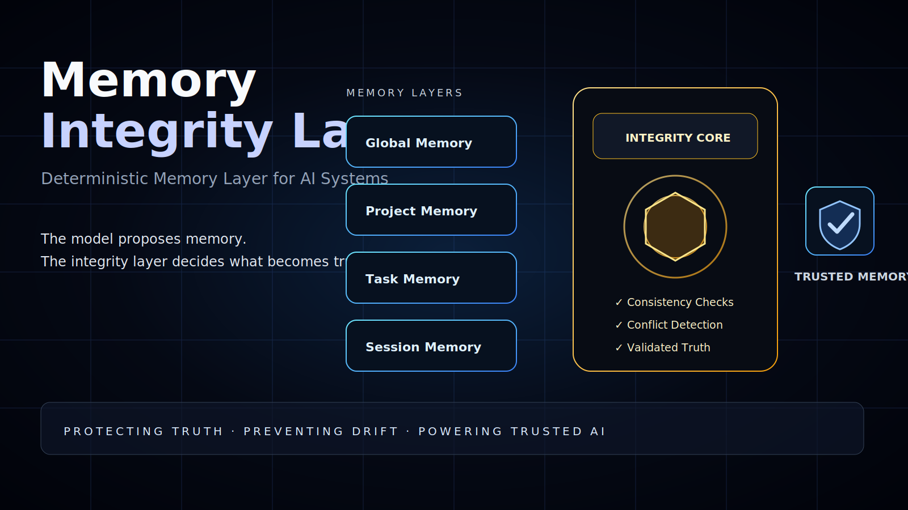

# Project Memory Controller



## Deterministic project memory for AI workflows

Project Memory Controller is a deterministic memory layer for AI-assisted projects.

AI models can generate, suggest, summarize, and reason — but they should not silently decide what becomes project truth.

This project separates:

- AI-generated output
- project memory
- locked decisions
- validated state
- human-approved changes

> The model proposes.  
> Project Memory Controller decides what becomes project memory.

---

## Problem

When working with AI on real projects, memory can drift.

Common failure modes:

- the AI forgets previous decisions
- removed components return later
- temporary ideas become treated as facts
- project scope mutates without approval
- different threads contaminate each other
- architecture decisions get overwritten
- the AI confidently contradicts locked constraints

This is not only a hallucination problem.

It is a project state integrity problem.

---

## Solution

Project Memory Controller introduces a controlled memory boundary between AI output and persistent project state.

Every memory update should be treated as a proposal first.

Before becoming project truth, it must be checked against:

- existing project memory
- locked decisions
- current task scope
- architecture constraints
- conflict rules
- human approval requirements

Possible outcomes:

- `ACCEPT`
- `REJECT`
- `REQUIRE_HUMAN_APPROVAL`

---

## Core Architecture

```txt
User / AI Conversation
        ↓
Memory Update Proposal
        ↓
Project Memory Controller
        ↓
Validation Engine
        ↓
Conflict Detector
        ↓
Approval Gate
        ↓
Validated Project Memory
```

---

## Core Principle

```txt
AI can suggest memory.
AI cannot directly write memory.
```

---

## Memory Layers

```txt
Global Memory   → stable system-level rules
Project Memory  → persistent project truth
Task Memory     → active task constraints
Session Memory  → temporary conversation context
```

Temporary context should not become permanent memory without validation.

---

## MVP Scope

The first version is focused on a simple file-based memory controller.

```txt
INPUT:
memory.state.json + proposed-update.json

OUTPUT:
validation-report.json
```

MVP features:

- structured project memory
- memory update proposals
- locked memory entries
- contradiction detection
- validation reports
- human approval flow

---

## Status

Architecture phase.  
Prototype runtime upcoming.

---

## License

This repository is released under a custom source-available license.

See [`LICENSE`](LICENSE).
